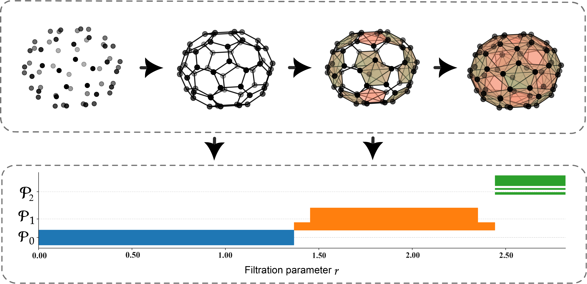

# CAML

<div align='center'>
 
<!-- [](https://www.google.com/) -->
[](https://opensource.org/licenses/MIT)

</div>

**Title** - CAML: Commutative algebra machine learning --- A case study on protein-ligand binding affinity prediction.

**Authors** - Hongsong Feng, Faisal Suwayyid, Mushal Zia, JunJie Wee, Yuta Hozumi, Chunlong Chen, and Guo-Wei Wei.

---

## Table of Contents

- [Table of Contents](#table-of-contents)
- [Introduction](#introduction)
- [Model Architecture](#model-architecture)
- [Prerequisites](#prerequisites)
- [Visualization tools](#Visualization-tools)
- [Datasets](#datasets)
- [Modeling with mGLI-based features](#Modeling-with-mGLI-based-features)
    - [mGLI-based B-factor prediction](#i-mgli-based-b-factor-prediction)
    - [Generation of mGLI-based features for protein-ligand complex](#II-Generation-of-mGLI-based-features-for-protein-ligand-complex)
    - [Generation of mGLI-based features for small molecule](#III-Generation-of-mGLI-based-features-for-small-molecule)
    - [Generation of sequence-based features for protein or small molecules](#IV-Generation-of-sequence-based-features-for-protein-or-small-molecules)

- [Results](#results)
    - [I. Modeling the B-factor datasets]()
    - [II. Modeling the PDBbind datasets]()
- [License](#license)
- [Citation](#citation)

---

## Introduction

Recently, Suwayyid and Wei have introduced commutative algebra as an emerging paradigm for machine learning and data science. In this work, we propose commutative algebra machine learning (CAML) for the prediction of protein-ligand binding affinities. Specifically, we apply persistent Stanley–Reisner theory, a key concept in combinatorial commutative algebra, to the affinity predictions of protein-ligand binding and metalloprotein-ligand binding. We present three new algorithms, i.e., element-specific commutative algebra, category-specific commutative algebra, and commutative algebra on bipartite complexes, to tackle the complexity of data involved in (metallo) protein-ligand complexes. We show that the proposed CAML outperforms other state-of-the-art methods in (metallo) protein-ligand binding affinity predictions, indicating the great potential of commutative algebra learning.   

> **Keywords**: Persistent commutative algebra, facet persistence barcodes, persistent ideals, commutative algebra learning, protein-ligand binding.

---

## Model Architecture

An illustration of the filtration process of the persistent commutative algebra is shown below.



Further explain the details in the [paper](https://github.com/WeilabMSU/CAML), providing context and additional information about the architecture and its components.

---

## Prerequisites

- numpy                     1.21.0
- scipy                     1.7.3
- pytorch                   1.10.0 
- pytorch-cuda              11.7
- torchvision               0.11.1
- scikit-learn              1.0.2
- python                    3.10.12
- biopandas                 0.4.1
- Biopython                 1.75

--- 

## Datasets

A brief introduction about the benchmark datasets.

| Datasets                |Total    | Training Set                 | Test Set                                             |
|-|-----------------------------|------------------------------|------------------------------                        |
| PDBbind-v2016       |4057|3767  [Label](https://weilab.math.msu.edu/Downloads/mGLI-KDA/PDBbind.zip)                        | 290 [Label](https://weilab.math.msu.edu/Downloads/CAML/PDBbind.zip)                         |
| Metalloprotein-ligand       |2463|1845  [Label](https://weilab.math.msu.edu/Downloads/mGLI-KDA/PDBbind.zip)                        | 618 [Label](https://weilab.math.msu.edu/Downloads/CAML/Metalloprotein-ligand.zip)                         |


- PDBbind-v2016: the protein-ligand complex structures. Download from [PDBbind database](http://www.pdbbind.org.cn/)
- Metalloprotein-ligand: the metalloprotein-ligand complex structures were complied from PDBbind-v2020([PDBbind database](http://www.pdbbind.org.cn/)) by [Jiang2023]
- Label: the .csv file, which contains the protein ID and corresponding binding affinity for PDBbind data.
---

## Modeling with mGLI-based features

### I. Generation of mGLI-based features for protein-ligand complex
Example with PDB 2eg8, generating mGLI features with "bin" manner and "median" statistics for atom-by-atom Gauss linking integral.
"all" can also be used and "std" statistics is also available for atom-by-atom Gauss linking integral, output: 2eg8-complex-median-bin.npy
```shell
python codes/mGLI-protein-ligand.py --pdbid 2eg8 --bin_or_all bin --integral_type median
```

### II. Generation of mGLI-based features for small molecule
Example with the ligand in protein complex PDB 2eg8, generating mGLI features with "bin" manner and "median" statistics for atom-by-atom Gauss linking integral. Statistics of "all" can also be used.  output: 2eg8-ligand-median-bin.npy
```shell
python codes/mGLI-ligand.py --mol2_path datasets/PDBbind/2eg8/2eg8_ligand.mol2 --mol2_id 2eg8 --bin_or_all bin --integral_type median
```
### IV. Generation of sequence-based features for protein or small molecules
Protein sequence embeddings were generated with [Transformer Protein language model](https://github.com/facebookresearch/esm).

Small molecular sequence embeddings were generated with
[Transformer small molecule language model](https://github.com/WeilabMSU/PretrainModels).

---

## Results

### I. Modeling the Metalloprotein-ligand datasets


|Datasets                                        | Training Set                  | Test Set| PCC | RMSE (kcal/mol) |
|-------------------------------------------------|-------------                  |---------|-    |-                |
| PDBbind-v2016 [result](./Results)      | 3767 | 290 | 0.858 |1.673|
| Metalloprotein-ligand [result](./Results) |1845| 618 | 0.755 |1.947|


Note, twenty gradient boosting regressor tree (GBRT) models were built for each dataset with 20 indenpedent runs with different random numbers. The PSRT-based features and transformer-based features were paired with GBRT, respectively. The predictions can be found in the [results](./Results) folder. 

---

## License

This project is licensed under the MIT License - see the [LICENSE](LICENSE) file for details.

---

## Citation

- [Jiang2023] Dejun Jiang, Zhaofeng Ye, Chang-Yu Hsieh, Ziyi Yang, Xujun Zhang, Yu Kang, Hongyan Du, Zhenxing Wu, Jike Wang, Yundian Zeng, et al. Metalprognet: a structure-based deep graph model for metalloprotein–ligand interaction predictions. Chemical Science, 14(8):2054–2069, 2023.
---
